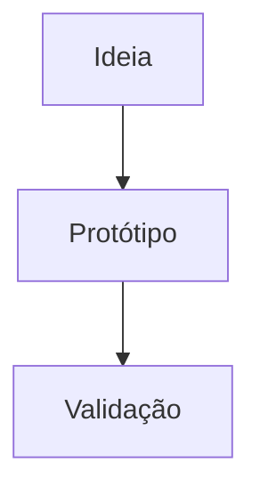
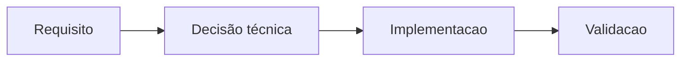

# Guia de escrita dos artigos

Este é o guia oficial para escrever artigos no PauloGerm.dev.

Ele descreve apenas o que o projeto suporta hoje, com base na estrutura atual de Astro, Content Collections, Markdown, Mermaid, blocos de código, imagens e embeds.

## Índice

- [Introdução](#introdução)
- [Estrutura dos arquivos](#estrutura-dos-arquivos)
- [Frontmatter](#frontmatter)
- [Títulos](#títulos)
- [Texto](#texto)
- [Ênfase](#ênfase)
- [Blocos de código](#blocos-de-código)
- [Mermaid](#mermaid)
- [Links](#links)
- [Imagens](#imagens)
- [PDFs, documentos e vídeos locais](#pdfs-documentos-e-vídeos-locais)
- [Embeds](#embeds)
- [Boas práticas](#boas-práticas)
- [Erros comuns](#erros-comuns)
- [Checklist antes de publicar](#checklist-antes-de-publicar)
- [FAQ](#faq)

## Introdução

Os artigos do projeto ficam em `src/content/blog/` e são renderizados por Astro Content Collections.

Cada artigo é um arquivo Markdown com frontmatter no início. Durante o build, apenas artigos com `draft: false` são publicados nas rotas do blog, na home, na busca, no RSS, no sitemap e nos artigos relacionados.

O conteúdo do artigo é renderizado dentro de `.prose-body` e recebe suporte adicional para:

- blocos de código com destaque de sintaxe e botão de copiar;
- diagramas Mermaid;
- imagens em Markdown;
- links comuns;
- embeds usando a sintaxe `[embed: Título](URL)`;
- artigos relacionados por tags.

## Estrutura dos arquivos

### Onde criar artigos

Crie artigos em:

```text
src/content/blog/
```

Exemplo:

```text
src/content/blog/meu-novo-artigo.md
```

O slug da página é baseado no nome do arquivo. Por exemplo:

```text
src/content/blog/meu-novo-artigo.md
```

gera:

```text
/blog/meu-novo-artigo/
```

### Extensão recomendada

Use `.md`.

O loader da collection aceita o padrão `**/*.{md,mdx}`, mas o projeto não possui integração MDX configurada em `astro.config.mjs` nem dependência `@astrojs/mdx`. Portanto, para escrita editorial normal, considere Markdown (`.md`) como o formato suportado.

MDX não deve ser usado sem validação adicional.

### Onde ficam imagens, PDFs, documentos e vídeos

Arquivos que precisam ser acessados pelo navegador devem ficar dentro de `public/`.

As imagens públicas ficam em:

```text
public/images/
```

PDFs e documentos públicos devem ficar em:

```text
public/docs/
```

Vídeos públicos devem ficar em:

```text
public/videos/
```

O caminho usado no Markdown sempre ignora o prefixo `public/`.

Exemplos:

| Arquivo no projeto | Caminho no artigo |
|---|---|
| `public/images/blog/meu-artigo/capa.png` | `/images/blog/meu-artigo/capa.png` |
| `public/docs/blog/meu-artigo/material.pdf` | `/docs/blog/meu-artigo/material.pdf` |
| `public/videos/blog/meu-artigo/demo.mp4` | `/videos/blog/meu-artigo/demo.mp4` |

Hoje a organização real encontrada para imagens de artigos é:

```text
public/images/blog/parkflow/
├── dashboard-refinado.png
└── interface-inicial.png
```

Também existe uma imagem padrão para Open Graph:

```text
public/images/og-default.png
```

### Organização recomendada por artigo

Para novos artigos com imagens, PDFs, documentos ou vídeos, mantenha a organização por artigo usando o mesmo slug do Markdown.

Exemplo:

```text
src/content/blog/meu-artigo.md

public/
├── images/
│   └── blog/
│       └── meu-artigo/
│           ├── capa.png
│           └── diagrama.png
├── docs/
│   └── blog/
│       └── meu-artigo/
│           ├── material-complementar.pdf
│           └── requisitos.pdf
└── videos/
    └── blog/
        └── meu-artigo/
            └── demonstracao.mp4
```

No Markdown, referencie com caminho absoluto a partir de `public`:

```md


[Baixar material complementar](/docs/blog/meu-artigo/material-complementar.pdf)

[embed: Demonstração em vídeo](/videos/blog/meu-artigo/demonstracao.mp4)
```

### Nomenclatura dos arquivos

Use nomes em minúsculas, sem espaços, com hífens:

```text
consumir-conteudo-nao-e-estudar.md
parkflow-do-levantamento-de-requisitos-ao-mvp.md
```

Evite:

- espaços;
- nomes genéricos como `imagem1.png`;
- caracteres difíceis de digitar;
- arquivos soltos demais em `public/images/blog/`.

## Frontmatter

Todo artigo precisa começar com frontmatter YAML entre `---`.

Exemplo completo:

```md
---
title: "Título do artigo"
description: "Resumo curto do artigo."
image: /images/blog/meu-artigo/capa.png
publishedAt: 2026-06-22
tags:
  - Engenharia de Software
  - TypeScript
featured: false
draft: false
---
```

### Campos suportados

| Campo | Obrigatório | Tipo | Descrição |
|---|---:|---|---|
| `title` | Sim | string | Título do artigo. É usado no cabeçalho da página, SEO, Open Graph, Twitter Cards, busca e RSS. |
| `description` | Sim | string | Resumo curto. É usado no cabeçalho da página, SEO, Open Graph, Twitter Cards, busca e RSS. |
| `image` | Não | string | Imagem social do artigo. Se ausente, o layout usa `/images/og-default.png`. |
| `publishedAt` | Sim | data | Data de publicação. É convertida com `z.coerce.date()`. |
| `tags` | Não | array de strings | Tags do artigo. O padrão é `[]`. Usadas no artigo, busca, listagens e artigos relacionados. |
| `featured` | Não | boolean | Define se o artigo pode aparecer na área de destaques da home. O padrão é `false`. |
| `draft` | Não | boolean | Se `true`, o artigo não é publicado. O padrão é `false`. |

### `title`

Use um título claro, específico e legível.

```yaml
title: "ParkFlow: do levantamento de requisitos a um MVP assistido por IA"
```

### `description`

Escreva um resumo curto, com contexto suficiente para listagens, busca e SEO.

```yaml
description: "Como transformamos um problema real de estacionamento em um MVP com TypeScript, Supabase, UX orientada à placa e desenvolvimento assistido por IA."
```

### `image`

Campo opcional para imagem social.

```yaml
image: /images/blog/parkflow/dashboard-refinado.png
```

Limitações:

- o projeto aceita string, não valida se o arquivo existe;
- se a imagem estiver errada, o build pode passar, mas o navegador não carregará a imagem;
- use caminho absoluto começando com `/images/...`.

### `publishedAt`

Use data válida.

```yaml
publishedAt: 2026-06-22
```

Evite datas inválidas como:

```yaml
publishedAt: 2026-06-00
```

Esse formato aparece em template antigo, mas não é uma data real. Para publicar, use dia válido.

### `tags`

Pode ser escrito em lista:

```yaml
tags:
  - Engenharia de Software
  - TypeScript
  - Supabase
```

Ou inline:

```yaml
tags: ["Engenharia de Software", "TypeScript"]
```

As tags ajudam nos artigos relacionados. O algoritmo compara tags normalizadas e mostra até 3 artigos relacionados publicados.

### `featured`

Use `true` apenas em artigos que devem aparecer nos destaques da home.

```yaml
featured: true
```

### `draft`

Use `true` enquanto estiver escrevendo ou testando.

```yaml
draft: true
```

Artigos em draft são filtrados em:

- home;
- `/blog`;
- busca;
- RSS;
- sitemap;
- rotas estáticas de artigos;
- artigos relacionados.

## Títulos

Markdown suporta títulos de `#` até `######`.

O projeto, porém, possui comportamento específico:

- o layout já renderiza o `title` do frontmatter como título principal visual do artigo;
- o sumário lateral usa apenas headings `##` e `###`;
- o CSS customizado estiliza principalmente `h2` e `h3` dentro do corpo do artigo.

### H1

Sintaxe:

```md
# Título principal
```

O projeto permite H1 dentro do Markdown e os templates atuais usam H1. Porém, o layout já cria um título principal a partir do frontmatter.

Recomendação: para novos artigos, prefira usar o H1 do Markdown apenas se você quiser repetir explicitamente o título no corpo. Caso contrário, comece o conteúdo por uma introdução e use `##` nas seções.

### H2

Use para seções principais.

```md
## O problema que queríamos resolver
```

H2 aparece no sumário lateral do artigo em telas maiores.

### H3

Use para subseções dentro de um H2.

```md
### Requisitos funcionais
```

H3 também aparece no sumário lateral.

### H4

Use com moderação para detalhes muito específicos.

```md
#### Observação técnica
```

Limitação: H4 é renderizado pelo Markdown, mas não entra no sumário lateral e não possui estilo customizado específico como H2/H3.

## Texto

### Parágrafos

Separe parágrafos com uma linha em branco.

```md
Este é o primeiro parágrafo.

Este é o segundo parágrafo.
```

### Listas

Use listas para quebrar ideias longas.

```md
- primeiro ponto
- segundo ponto
- terceiro ponto
```

Também funciona com `*`, como aparece em um dos templates:

```md
* primeiro ponto
* segundo ponto
```

Para consistência, prefira `-`.

### Listas numeradas

Use quando a ordem importar.

```md
1. Levantar requisitos.
2. Criar o fluxo principal.
3. Validar com testes.
```

### Citações

Use `>` para destacar uma frase, contexto ou observação.

```md
> O conhecimento começa no consumo, mas só se consolida na prática.
```

O projeto estiliza blockquotes com borda lateral e cor mais discreta.

### Separadores

Use `---` para separar blocos grandes de conteúdo.

```md
---
```

Os templates atuais usam separadores entre seções.

### Notas

Não existe componente específico de nota, alerta ou callout no projeto.

Use uma citação simples quando precisar destacar um aviso:

```md
> Observação: este projeto ainda é educacional e não representa uma solução final de produção.
```

### Destaques

Não existe sintaxe customizada de destaque além do Markdown padrão.

Use negrito, itálico, citações ou listas para dar ênfase.

## Ênfase

### Negrito

```md
**texto em negrito**
```

### Itálico

```md
*texto em itálico*
```

### Tachado

```md
~~texto removido~~
```

O suporte a tachado vem do Markdown/GFM usado pelo pipeline do Astro. Se notar comportamento diferente em alguma versão futura, valide com `npm run build`.

### Inline code

Use crases para termos técnicos, comandos curtos, nomes de arquivos ou identificadores.

```md
Use `npm run build` antes de publicar.
```

O projeto estiliza inline code com fundo discreto, borda e fonte monoespaçada.

## Blocos de código

### Como criar

Use três crases e informe a linguagem.

````md
```ts
const message = 'Olá, mundo';
console.log(message);
```
````

### Destaque de sintaxe

O projeto usa Shiki via configuração do Astro:

```js
markdown: {
  syntaxHighlight: {
    type: 'shiki',
    excludeLangs: ['mermaid']
  },
  shikiConfig: {
    theme: 'github-dark'
  }
}
```

Mermaid é excluído do Shiki porque recebe tratamento próprio.

### Botão de copiar

Nas páginas de artigo, o componente `CodeBlockEnhancer` transforma blocos de código comuns em blocos com:

- barra superior;
- nome da linguagem;
- botão `Copiar`;
- feedback `Copiado ✓`.

Blocos Mermaid são ignorados pelo `CodeBlockEnhancer`, pois são processados pelo `MermaidRenderer`.

### Linguagens nomeadas no botão

O enhancer possui nomes amigáveis para:

- `bash`
- `css`
- `html`
- `javascript`
- `js`
- `json`
- `mermaid`
- `shell`
- `sql`
- `text`
- `plaintext`
- `ts`
- `typescript`
- `yaml`
- `yml`

Outras linguagens podem aparecer com o nome em maiúsculas se o bloco renderizar corretamente.

### Exemplos

TypeScript:

````md
```ts
type User = {
  id: string;
  name: string;
};
```
````

Bash:

````md
```bash
npm run build
```
````

Texto simples:

````md
```text
src/
├── content/
└── pages/
```
````

### Boas práticas para código

- Sempre informe a linguagem.
- Prefira exemplos curtos.
- Explique antes ou depois do bloco o que o código demonstra.
- Não cole segredos, tokens, URLs privadas ou credenciais.
- Para árvores de diretório, use `text`.

## Mermaid

O projeto possui suporte específico para Mermaid nas páginas de artigo.

### Como escrever

Use um bloco de código com linguagem `mermaid`.

````md

````

O `MermaidRenderer` encontra blocos `.prose-body pre > code.language-mermaid`, substitui por um bloco visual e renderiza o SVG.

### Funcionalidades disponíveis

O componente Mermaid atual oferece:

- renderização client-side;
- tema compatível com tema claro/escuro;
- `securityLevel: 'strict'`;
- `htmlLabels: false`;
- botão `Ampliar`;
- modal com zoom;
- controles de zoom;
- pan/arraste quando necessário;
- fallback com mensagem de erro e código-fonte se o diagrama falhar.

### Diagramas usados no projeto

O artigo ParkFlow usa Mermaid para fluxos e diagramas de arquitetura. O pacote `mermaid` é instalado no projeto, então os tipos suportados dependem da versão instalada da biblioteca.

Não foi possível confirmar pela análise do projeto uma lista fechada de todos os tipos de diagramas suportados pela versão atual.

### Exemplo recomendado

````md

````

### Limitações

- Mermaid é renderizado no navegador, não como HTML estático puro.
- Diagramas muito grandes podem precisar do botão `Ampliar`.
- Se a sintaxe estiver inválida, o componente mostra erro e permite ver o código-fonte.
- HTML dentro dos labels não é recomendado, pois o renderer usa `htmlLabels: false` e `securityLevel: 'strict'`.

## Links

### Links externos

Use Markdown padrão:

```md
[Aplicação ParkFlow](https://parkflow-sys.lovable.app/)
```

Links no corpo do artigo não são configurados automaticamente para abrir em nova aba.

### Links internos

Use caminhos absolutos do site:

```md
[Sobre este espaço](/sobre)
[Projetos](/projetos)
```

### Links para outros artigos

Use o slug gerado pelo nome do arquivo:

```md
[Artigo relacionado](/blog/parkflow-do-levantamento-de-requisitos-ao-mvp/)
```

O template antigo usa `/blog/slug-do-artigo` sem barra final; o projeto geralmente gera rotas com barra final. Para consistência, prefira:

```md
/blog/slug-do-artigo/
```

### Links para seções

Headings geram âncoras automaticamente.

Exemplo:

```md
## O que aprendi
```

Pode ser referenciado como:

```md
[Ir para O que aprendi](#o-que-aprendi)
```

Para headings com acentos, o slug é gerado pelo pipeline do Astro. Em caso de dúvida, rode o site localmente e copie o link do sumário lateral.

### Como alterar o texto do link

O texto entre colchetes é o texto exibido:

```md
[Texto que aparece para o leitor](https://exemplo.com)
```

### Links para arquivos públicos do artigo

Use links normais quando o leitor deve baixar ou abrir um arquivo, sem incorporar o conteúdo na página.

PDF:

```md
[Baixar PDF complementar](/docs/blog/meu-artigo/material-complementar.pdf)
```

Documento:

```md
[Abrir documento de requisitos](/docs/blog/meu-artigo/requisitos.pdf)
```

Vídeo:

```md
[Abrir vídeo de demonstração](/videos/blog/meu-artigo/demonstracao.mp4)
```

Regra importante: se o arquivo está em `public/docs/...`, o link começa com `/docs/...`. Se está em `public/videos/...`, o link começa com `/videos/...`.

## Imagens

### Onde armazenar

Use `public/images/`.

Para imagens de artigo, prefira:

```text
public/images/blog/nome-do-artigo/
```

Para manter todos os assets de um artigo fáceis de encontrar, use o mesmo slug do artigo:

```text
src/content/blog/nome-do-artigo.md
public/images/blog/nome-do-artigo/
```

### Como referenciar

Como arquivos em `public/` são servidos a partir da raiz do site, use:

```md

```

Exemplo real:

```md

```

### Caminhos absolutos

Recomendado:

```md

```

### Caminhos relativos

Não há exemplos reais de imagens referenciadas por caminho relativo nos artigos atuais.

Recomendação: use caminhos absolutos a partir de `public`, como `/images/...`, para manter consistência.

### Formatos recomendados

O projeto atualmente usa PNG para imagens de artigo e Open Graph.

Formatos seguros para uso no navegador:

- `.png`
- `.jpg` / `.jpeg`
- `.webp`
- `.svg` com cuidado

Não foi possível confirmar pela análise do projeto uma política específica de otimização de imagens.

### Boas práticas para imagens

- Sempre escreva alt text descritivo.
- Use nomes de arquivo claros: `dashboard-refinado.png`, não `print1.png`.
- Evite imagens enormes sem necessidade.
- Agrupe imagens por artigo ou tema.
- Confira se o arquivo existe em `public/images/...`.
- Para imagem social do artigo, use o campo `image` no frontmatter.

## PDFs, documentos e vídeos locais

Além de imagens, o projeto pode servir arquivos públicos colocados em `public/`.

### PDFs e documentos

Use:

```text
public/docs/blog/nome-do-artigo/
```

Exemplo de organização:

```text
public/docs/blog/meu-artigo/
├── material-complementar.pdf
└── requisitos.pdf
```

Link normal para abrir ou baixar:

```md
[Baixar material complementar](/docs/blog/meu-artigo/material-complementar.pdf)
```

Embed para mostrar o PDF dentro do artigo:

```md
[embed: Material complementar em PDF](/docs/blog/meu-artigo/material-complementar.pdf)
```

Limitação: a infraestrutura atual de embeds reconhece PDF por extensão `.pdf`. Outros tipos de documento local, como `.docx`, `.xlsx` ou `.pptx`, podem ser servidos como link normal se estiverem em `public/docs/`, mas não possuem embed local específico confirmado.

### Vídeos HTML5

Use:

```text
public/videos/blog/nome-do-artigo/
```

Exemplo de organização:

```text
public/videos/blog/meu-artigo/
└── demonstracao.mp4
```

Link normal:

```md
[Abrir vídeo de demonstração](/videos/blog/meu-artigo/demonstracao.mp4)
```

Embed HTML5:

```md
[embed: Demonstração em vídeo](/videos/blog/meu-artigo/demonstracao.mp4)
```

Extensões suportadas pelo adaptador de vídeo local:

- `.mp4`
- `.webm`
- `.ogg`

### Regra prática

Use link normal quando o arquivo é material complementar.

Use embed quando o arquivo faz parte da leitura do artigo e deve aparecer inline.

## Embeds

O projeto possui infraestrutura própria para embeds em artigos.

### Sintaxe única

Use:

```md
[embed: Título descritivo](https://url-da-plataforma)
```

O texto depois de `embed:` vira o título acessível do embed.

Links comuns continuam sendo links comuns. Apenas links cujo texto começa com `embed:` são transformados.

### Regras gerais

O renderer:

- aceita apenas URLs reconhecidas;
- exige HTTPS para plataformas externas;
- usa allowlist de domínios;
- permite caminhos locais do próprio site para PDF e vídeo HTML5;
- renderiza fallback amigável quando a URL não é suportada;
- usa dimensões controladas por configuração central.

### YouTube

Formatos aceitos:

- `https://youtu.be/...`
- `https://youtube.com/watch?v=...`
- `https://www.youtube.com/watch?v=...`
- caminhos `/embed/`, `/shorts/`, `/live/` e `/v/`

Exemplo:

```md
[embed: Demonstração YouTube](https://youtu.be/tIrcxwLqzjQ?si=epYJcsgqeMN9HptY)
```

Layout: proporção 16:9, largura 100%, altura controlada.

### Vimeo

Exemplo:

```md
[embed: Vídeo no Vimeo](https://vimeo.com/76979871)
```

Também aceita URLs de `player.vimeo.com/video/...`.

Layout: proporção 16:9.

### Loom

Exemplo:

```md
[embed: Demonstração no Loom](https://www.loom.com/share/abc123)
```

Também aceita `/embed/...`.

Limitação: o ID precisa estar em uma URL pública válida do Loom.

### Spotify

Exemplo:

```md
[embed: Música no Spotify](https://open.spotify.com/track/4cOdK2wGLETKBW3PvgPWqT)
```

Tipos aceitos:

- `track`
- `episode`
- `album`
- `artist`
- `playlist`
- `show`

`track` e `episode` usam altura compacta. Os demais usam altura maior, mas controlada.

### Google Drive Preview

Exemplo:

```md
[embed: Arquivo no Drive](https://drive.google.com/file/d/ID_DO_ARQUIVO/view)
```

O adaptador converte para:

```text
https://drive.google.com/file/d/ID_DO_ARQUIVO/preview
```

Limitação: o arquivo precisa estar compartilhado de forma que o preview seja acessível.

### Google Docs

Exemplo:

```md
[embed: Documento de referência](https://docs.google.com/document/d/ID_DO_DOCUMENTO/edit)
```

Também há suporte para documentos publicados em `/document/d/e/.../pub`.

Limitação: documento privado pode não renderizar para leitores.

### Google Slides

Exemplo:

```md
[embed: Apresentação do projeto](https://docs.google.com/presentation/d/ID_DA_APRESENTACAO/edit)
```

Layout: proporção de apresentação 16:9.

### Google Sheets

Exemplo:

```md
[embed: Planilha de acompanhamento](https://docs.google.com/spreadsheets/d/ID_DA_PLANILHA/edit)
```

Layout: altura moderada com scroll interno.

### PDF

Use preferencialmente PDF local em `public/`.

Exemplo:

```md
[embed: Documento PDF](/docs/blog/meu-artigo/documento.pdf)
```

Limitação importante: PDFs remotos em domínios fora da allowlist não são renderizados. Eles caem no fallback de embed não suportado.

### GitHub Gist

Exemplo:

```md
[embed: Snippet de configuração](https://gist.github.com/usuario/abcdef1234567890)
```

O adaptador usa o formato `.pibb` do Gist.

Limitação: o Gist precisa ser público e o ID deve ser válido.

### StackBlitz

Exemplo:

```md
[embed: Projeto no StackBlitz](https://stackblitz.com/edit/projeto)
```

Também aceita caminhos `/github/...`.

Layout: altura controlada com scroll interno.

### CodeSandbox

Exemplo:

```md
[embed: Sandbox React](https://codesandbox.io/s/exemplo-abc123)
```

Também aceita `/embed/...` e alguns caminhos `/p/sandbox/...`.

### CodePen

Exemplo:

```md
[embed: Experimento de interface](https://codepen.io/usuario/pen/abc123)
```

O adaptador converte para o formato `/embed/...`.

### Figma

Exemplo:

```md
[embed: Protótipo no Figma](https://www.figma.com/design/ID_DO_ARQUIVO/Nome)
```

Tipos aceitos no caminho:

- `file`
- `design`
- `proto`
- `board`

Limitação: o arquivo precisa permitir acesso para quem lê.

### Excalidraw

Exemplo:

```md
[embed: Diagrama no Excalidraw](https://link.excalidraw.com/readonly/abc123)
```

Limitação: uma URL vazia de `excalidraw.com/` não é renderizada.

### Vídeo HTML5

Use para vídeos locais públicos.

Exemplo:

```md
[embed: Demonstração em vídeo](/videos/blog/meu-artigo/demo.mp4)
```

Extensões aceitas:

- `.mp4`
- `.webm`
- `.ogg`

### Plataforma não suportada

Se a URL não for permitida, o artigo mostra um bloco amigável informando que o embed não é suportado e oferece link para abrir o conteúdo original.

Exemplo que não deve renderizar iframe:

```md
[embed: Plataforma externa](https://example.com/embed/demo)
```

## Boas práticas

### Tamanho dos artigos

Não existe limite técnico definido no projeto.

Recomendação editorial:

- escreva artigos com começo, meio e fechamento;
- divida textos longos em seções H2;
- use H3 para detalhar partes técnicas;
- evite blocos gigantes sem respiro.

### Organização

Uma estrutura boa para artigos técnicos:

```md
## Contexto

## Problema

## Decisões

## Implementação

## Resultado

## O que aprendi

## Próximos passos

## Conclusão
```

### Escrita

- Prefira frases claras.
- Explique o contexto antes da solução.
- Diferencie requisito, decisão, implementação e resultado.
- Quando algo for hipótese, diga que é hipótese.
- Quando algo for limitação, deixe explícito.

### Uso de imagens

- Use imagem quando ela explicar melhor que texto.
- Evite prints redundantes.
- Nomeie arquivos com clareza.
- Sempre use alt text.

### Uso de código

- Mostre apenas o trecho necessário.
- Informe a linguagem no bloco.
- Explique o que o código demonstra.
- Não cole credenciais.

### Uso de Mermaid

- Use para fluxos, decisões, arquitetura e sequência.
- Mantenha diagramas pequenos quando possível.
- Para diagramas grandes, confie no botão `Ampliar`, mas não exagere.

### Uso de embeds

- Use embeds quando eles forem parte central da explicação.
- Evite vários embeds pesados em sequência.
- Prefira links normais quando o conteúdo externo for apenas referência.
- Teste no tema claro e escuro.
- Teste em mobile.

## Erros comuns

### Frontmatter inválido

Erro:

```yaml
publishedAt: 2026-06-00
```

Use data real:

```yaml
publishedAt: 2026-06-22
```

### Campo obrigatório faltando

`title`, `description` e `publishedAt` são obrigatórios.

### Imagem em pasta incorreta

Erro comum:

```md

```

Prefira:

```md

```

### Link quebrado para artigo

Verifique se o slug corresponde ao nome real do arquivo.

```md
[Artigo](/blog/nome-exato-do-arquivo/)
```

### Linguagem errada no bloco de código

Erro:

````md
```typescriptreact
const x = 1;
```
````

Se não tiver certeza, use uma linguagem conhecida pelo projeto:

````md
```ts
const x = 1;
```
````

### Mermaid com sintaxe inválida

Se o diagrama falhar, o componente mostra erro e permite abrir o código-fonte.

Revise a sintaxe do bloco `mermaid`.

### URL de embed incompatível

Erro:

```md
[embed: Vídeo](http://youtube.com/watch?v=...)
```

Use HTTPS:

```md
[embed: Vídeo](https://www.youtube.com/watch?v=...)
```

### Esperar que link comum vire embed

Isto é apenas um link:

```md
[Vídeo](https://www.youtube.com/watch?v=...)
```

Para embed, use:

```md
[embed: Vídeo](https://www.youtube.com/watch?v=...)
```

### Usar MDX sem suporte configurado

Não use componentes JSX/MDX nos artigos sem configurar e validar MDX no projeto.

## Checklist antes de publicar

Antes de mudar `draft` para `false`, revise:

- [ ] `title` preenchido.
- [ ] `description` claro e curto.
- [ ] `publishedAt` com data válida.
- [ ] `tags` revisadas.
- [ ] `draft: false` apenas quando o artigo estiver pronto.
- [ ] `featured: true` apenas se o artigo deve aparecer nos destaques.
- [ ] Imagem social em `image`, se houver.
- [ ] Imagens carregando.
- [ ] Alt text das imagens revisado.
- [ ] Links internos funcionando.
- [ ] Links externos funcionando.
- [ ] Blocos de código com linguagem correta.
- [ ] Botão de copiar funcionando nos blocos de código.
- [ ] Diagramas Mermaid renderizando.
- [ ] Embeds renderizando ou mostrando fallback esperado.
- [ ] Artigo legível no mobile.
- [ ] Tema claro revisado.
- [ ] Tema escuro revisado.
- [ ] Revisão ortográfica feita.
- [ ] `npm run build` executado com sucesso.

## FAQ

### Onde eu crio um novo artigo?

Em:

```text
src/content/blog/
```

### Posso criar artigo em MDX?

O glob da collection aceita `.mdx`, mas o projeto não possui integração MDX configurada. Use `.md` para artigos.

### Como deixo um artigo invisível enquanto escrevo?

Use:

```yaml
draft: true
```

### Draft aparece no RSS?

Não. O RSS filtra artigos com `draft: true`.

### Draft aparece no sitemap?

Não deve aparecer em um build novo, porque as rotas estáticas de artigo também filtram drafts.

### Como adiciono imagem de capa/social?

Adicione `image` no frontmatter:

```yaml
image: /images/blog/meu-artigo/capa.png
```

### O que acontece se eu não definir `image`?

O layout usa o fallback:

```text
/images/og-default.png
```

### Como faço um link abrir em nova aba?

Não existe sintaxe Markdown especial no projeto para abrir links em nova aba. Links Markdown comuns renderizam como links normais.

### Como faço embed de YouTube?

Use:

```md
[embed: Título do vídeo](https://www.youtube.com/watch?v=ID)
```

### Posso colar iframe manual no Markdown?

O Markdown pode renderizar HTML bruto dependendo do pipeline, mas essa não é a prática recomendada neste projeto. Para embeds, use a sintaxe oficial:

```md
[embed: Título](URL)
```

### Como testo o artigo localmente?

Rode:

```bash
npm run dev
```

Abra:

```text
http://localhost:4321
```

### Como valido antes de publicar?

Rode:

```bash
npm run build
```

### Artigos relacionados são manuais?

Não. O componente usa tags em comum entre artigos publicados e mostra até 3 relacionados.

### O sumário lateral mostra todos os títulos?

Não. O sumário usa apenas H2 e H3.


