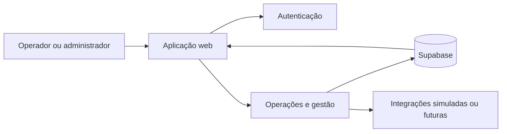
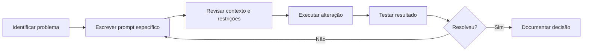
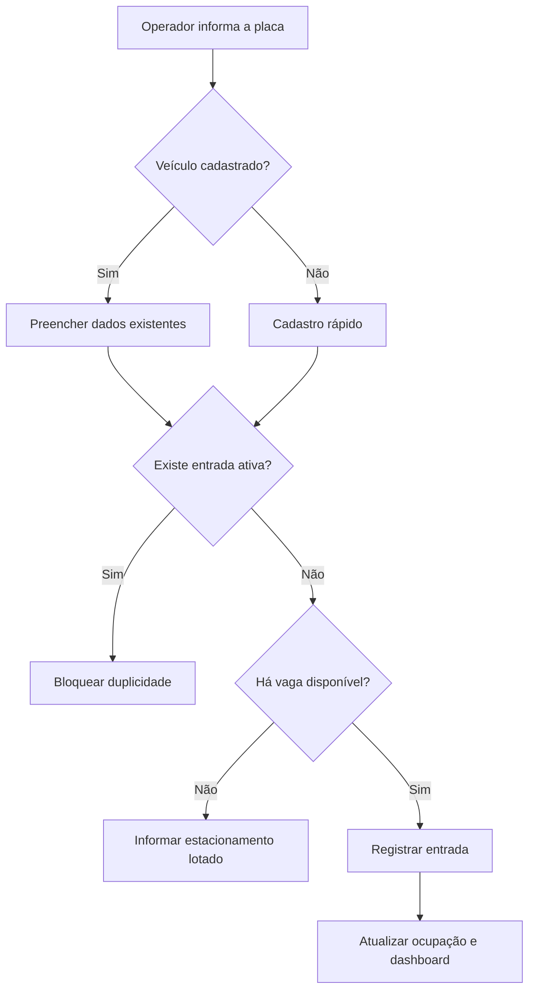
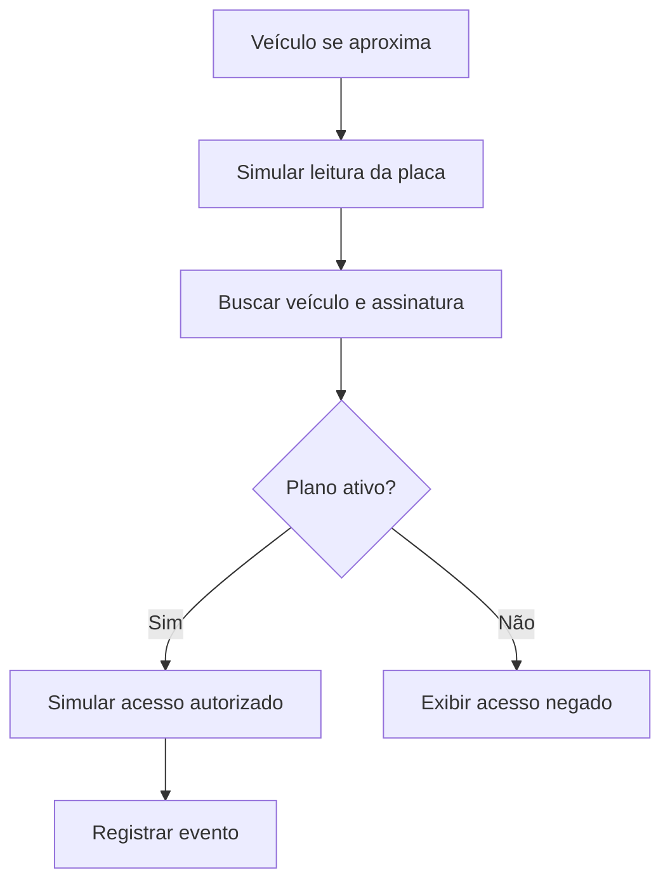

O ParkFlow nasceu como trabalho final do primeiro período de Análise e Desenvolvimento de Sistemas, na disciplina de Engenharia de Prompt e Aplicações em IA.

A proposta era desenvolver um sistema de estacionamento com apoio de inteligência artificial e uma ferramenta de *vibe coding*. Porém, o projeto deixou de ser apenas uma tela criada rapidamente quando começamos a discutir regras de negócio, experiência do operador, integridade dos dados e limitações técnicas.

Este artigo registra o processo de criação do MVP, as principais decisões tomadas e o que aprendi durante o desenvolvimento.

> O ParkFlow é um projeto educacional e de prototipação. Recursos relacionados a câmeras, reconhecimento de placas, cancelas e outros dispositivos devem ser tratados como simulações ou possibilidades futuras enquanto não houver integração real validada.

## O problema que queríamos resolver

A operação de um estacionamento envolve mais do que registrar a entrada de um carro.

Um sistema desse tipo precisa responder a perguntas como:

- quantas vagas ainda estão disponíveis?
- determinado veículo já está no estacionamento?
- quanto deve ser cobrado pelo tempo de permanência?
- o cliente possui uma mensalidade ativa?
- como preservar o histórico de entradas, saídas e pagamentos?
- como impedir que dados de contas diferentes sejam misturados?

Também percebemos que o atendimento poderia ficar lento caso o operador precisasse preencher nome, CPF e dados completos do veículo a cada entrada.

A ideia central do ParkFlow passou a ser:

> Centralizar e agilizar a operação de estacionamentos, reduzindo tarefas manuais e inconsistências.

## O levantamento de requisitos

Antes de tratar o projeto como produto, organizamos os requisitos em categorias.

### Requisitos funcionais

Entre as funções levantadas estavam:

- registrar entrada de veículos;
- emitir comprovante com QR Code ou código de barras;
- calcular o valor com base no tempo de permanência;
- cadastrar mensalistas e controlar pagamentos;
- gerar relatórios de faturamento diário e mensal.

### Requisitos não funcionais

Também registramos expectativas relacionadas à qualidade do sistema:

- interface responsiva;
- registro de entrada rápido;
- proteção de dados;
- disponibilidade durante a operação;
- estratégia de backup.

Esses itens foram definidos como requisitos do projeto, mas não devem ser confundidos com garantias já comprovadas. Métricas como disponibilidade de `99,9%`, criptografia completa e backup automático precisam de implementação, infraestrutura e testes específicos.

### Requisitos menos óbvios

Algumas necessidades só aparecem quando pensamos no funcionamento real:

- impedir duas entradas ativas para a mesma placa;
- liberar a vaga após a saída;
- manter logs de alterações;
- preservar histórico por vários anos;
- migrar dados de planilhas antigas;
- configurar impressoras térmicas e cancelas futuramente.

Esse levantamento mostrou que uma interface bonita não seria suficiente. O sistema precisava representar regras operacionais.

## A base técnica do projeto

A estrutura analisada no projeto utiliza:

| Área | Tecnologia ou organização |
|---|---|
| Linguagem | TypeScript |
| Aplicação web | Vite |
| Runtime e dependências | Bun |
| Backend e banco | Supabase |
| Banco versionado | Migrations |
| Qualidade | ESLint e Prettier |
| Interface | Componentes e estilos organizados no projeto |

A organização principal foi separada por responsabilidade:

```text
src/
├── components/
├── hooks/
├── integrations/
├── lib/
├── routes/
├── router.tsx
├── server.ts
└── styles.css

supabase/
├── migrations/
└── config.toml

docs/
└── prompts/
```

A intenção dessa estrutura é evitar que interface, regras reutilizáveis, integrações e acesso a dados fiquem misturados.

Uma visão simplificada da arquitetura é:



## Como usamos IA durante o desenvolvimento

Um dos principais aprendizados foi não tentar gerar todo o sistema com um único prompt.

Dividimos os pedidos por responsabilidade:

- interface e UX;
- autenticação;
- backend;
- banco de dados;
- controle de vagas;
- cobrança;
- testes;
- integrações futuras;
- refinamentos específicos.

O formato que mais ajudou foi:

```text
Contexto
Problema atual
Objetivo
Regras de negócio
Requisitos técnicos
O que não deve ser alterado
Resultado esperado
```

Também usamos um prompt específico para analisar e melhorar outros prompts antes da execução. A ideia era identificar falta de contexto, ambiguidades, riscos de arquitetura e requisitos esquecidos.

O ciclo de trabalho ficou próximo disto:



Na prática, o prompt passou a funcionar como uma pequena especificação técnica. Quanto mais claras eram as regras, menor era a chance de a alteração quebrar partes não relacionadas.

## Primeira versão: rápida, mas ainda pouco operacional

A primeira versão gerada permitiu visualizar o MVP rapidamente. Ela já apresentava módulos como dashboard, Smart Check-in, Smart Gate, monitoramento, mapa de vagas, veículos, planos e configurações.

Porém, a interface tinha muitos itens com a mesma prioridade visual, cards grandes e espaços que não ajudavam o operador a tomar decisões.


O problema não era apenas estético. A tela precisava parecer uma central de operações, e não uma coleção de páginas independentes.

## Refinando a interface como central de operações

O refinamento reorganizou a navegação em grupos como:

```text
Operações
Gestão
Sistema
```

Os cards ficaram mais compactos, e o dashboard passou a priorizar informações como:

- vagas livres;
- receita do dia;
- veículos atendidos;
- permanência média;
- fluxo de entradas;
- atividades recentes;
- alertas operacionais.


A principal mudança foi de hierarquia. Em vez de mostrar tudo com o mesmo peso, a interface começou a destacar o que o operador precisa acompanhar durante o trabalho.

## A decisão mais importante de UX: começar pela placa

O fluxo inicial exigia muitos dados antes de registrar uma entrada. Isso aumentava o tempo de atendimento e repetia informações de clientes já cadastrados.

A solução foi transformar a placa no primeiro ponto do processo.



Esse fluxo trouxe algumas regras importantes:

- CPF opcional no cadastro rápido;
- busca por placa;
- preenchimento automático para veículos conhecidos;
- bloqueio de entrada duplicada;
- validação da capacidade;
- estados de carregamento, sucesso e erro;
- uso amigável por teclado e em dispositivos móveis.

A melhoria não foi apenas visual. Ela alterou a sequência da operação para reduzir atrito.

## Autenticação e isolamento de dados

Um dos primeiros problemas encontrados foi a instabilidade dos fluxos de autenticação:

- sessão encerrando inesperadamente;
- login com falhas;
- cadastro sem funcionar corretamente;
- recuperação de senha com problemas;
- rotas protegidas precisando de revisão.

A correção precisava considerar mais do que a tela de login. Era necessário revisar:

- persistência de sessão;
- tokens e armazenamento;
- configuração do provedor de autenticação;
- callbacks e redirecionamentos;
- acesso direto a rotas privadas;
- consultas vinculadas ao usuário autenticado.

Outro requisito central foi o isolamento dos dados.

```text
Conta A → somente dados da Conta A
Conta B → somente dados da Conta B
```

Em um sistema com Supabase, isso exige consultas filtradas corretamente e políticas de acesso no banco. Não basta esconder dados no frontend.

## Integridade dos dados: nem tudo deve ser apagado

Um problema interessante apareceu ao remover um veículo que já possuía entradas registradas.

O banco bloqueou a exclusão porque existiam registros históricos vinculados ao veículo. Apagar tudo em cascata resolveria o erro técnico, mas destruiria informações operacionais e financeiras.

A decisão foi separar dois cenários:

| Situação | Comportamento |
|---|---|
| Veículo sem histórico | Pode ser excluído definitivamente |
| Veículo com histórico | Deve ser arquivado |
| Veículo atualmente estacionado | Remoção deve ser bloqueada |

O arquivamento, também conhecido como *soft delete*, retira o veículo das listagens operacionais sem apagar entradas, saídas, pagamentos ou relatórios antigos.

Campos previstos para essa estratégia incluem:

```sql
archived_at timestamp null
archived_by uuid null
archive_reason text null
```

Essa decisão mostrou por que regras de banco não podem ser tratadas como detalhes secundários da interface.

## Exclusão segura de zonas e vagas

A administração de vagas também precisava permitir a exclusão de uma zona inteira, sem obrigar o usuário a apagar cada vaga individualmente.

Mas essa ação não poderia ser irrestrita.

O fluxo definido foi:

1. selecionar a zona;
2. abrir um modal com nome e quantidade de vagas;
3. informar quantas estão livres e ocupadas;
4. bloquear a operação se houver vaga ocupada;
5. excluir a zona somente quando todas estiverem livres;
6. preservar históricos de entradas, saídas e pagamentos;
7. atualizar automaticamente a interface.

Essa é uma diferença importante entre “adicionar um botão” e implementar uma operação segura.

## Backup e exportação completa da conta

Outra evolução foi permitir a exportação de todos os dados de uma conta, e não apenas uma categoria por vez.

A proposta considera três formatos:

### CSV

Como CSV não suporta várias tabelas em um único arquivo, a ideia é gerar um `.zip` contendo arquivos separados:

```text
vehicles.csv
subscriptions.csv
plans.csv
access_logs.csv
entries_exits.csv
payments.csv
infractions.csv
parking_spots.csv
parking_zones.csv
settings.csv
```

### XLSX

Uma planilha com uma aba para cada tipo de dado.

### JSON

Um arquivo estruturado:

```json
{
  "exportedAt": "2026-06-22T00:00:00.000Z",
  "ownerId": "identificador-da-conta",
  "data": {
    "vehicles": [],
    "subscriptions": [],
    "plans": [],
    "entriesExits": [],
    "payments": [],
    "parkingSpots": []
  }
}
```

A regra mais importante é que a exportação deve respeitar o usuário autenticado e nunca incluir:

- dados de outras contas;
- tokens;
- chaves;
- variáveis de ambiente;
- segredos internos;
- informações sensíveis desnecessárias.

## Smart Gate e integrações futuras

O Smart Gate foi pensado para demonstrar um possível fluxo automatizado para mensalistas:



O projeto também foi planejado para futuras integrações com:

- câmeras IP;
- streams RTSP;
- provedores OCR/LPR;
- controladores de cancela;
- sensores de vaga;
- leitores de QR Code;
- impressoras térmicas.

A documentação, no entanto, deixa clara a limitação: esses recursos são simulados ou planejados. Eles não representam integração física já validada.

Essa distinção é importante para não apresentar um protótipo como se fosse um sistema de hardware em produção.

## Resultado do processo

O ParkFlow evoluiu de um MVP visual para uma proposta com regras mais próximas de um produto real.

| Decisão | Problema enfrentado | Resultado esperado |
|---|---|---|
| Check-in pela placa | Digitação repetitiva | Atendimento mais rápido |
| Bloqueio de duplicidade | Duas entradas para o mesmo veículo | Consistência operacional |
| Controle de capacidade | Entrada sem vaga disponível | Ocupação confiável |
| Isolamento por usuário | Mistura de dados entre contas | Segurança multiusuário |
| Arquivamento de veículos | Exclusão quebrando histórico | Preservação dos registros |
| Exclusão segura de zonas | Administração lenta ou perigosa | Operação controlada |
| Exportação completa | Backup fragmentado | Portabilidade dos dados |
| Prompts modulares | Alterações amplas e imprevisíveis | Refinamento incremental |

## O que aprendi

### 1. Requisito não é o mesmo que funcionalidade pronta

Documentar uma necessidade é apenas o início. Disponibilidade, criptografia, backup e desempenho precisam ser implementados e medidos.

### 2. UX depende do contexto operacional

O melhor formulário não é necessariamente o que coleta mais dados. No estacionamento, começar pela placa faz mais sentido do que começar pelo CPF.

### 3. Integridade do histórico deve orientar o banco

Excluir um registro principal pode afetar entradas, pagamentos e relatórios. Em alguns casos, arquivar é melhor do que apagar.

### 4. Segurança precisa existir no banco

Filtrar dados apenas na interface não garante isolamento. As regras devem ser aplicadas nas consultas e políticas de acesso.

### 5. Prompts melhores funcionam como especificações

Informar contexto, restrições, regras de negócio e critérios de aceite produz resultados mais previsíveis do que pedidos genéricos.

### 6. Simulação deve ser apresentada como simulação

Protótipos podem demonstrar ideias avançadas, mas precisam comunicar claramente o que é real, o que é simulado e o que ainda está no roadmap.

## Próximos passos

A documentação do projeto aponta como prioridades:

1. validar completamente login, cadastro, recuperação e persistência de sessão;
2. testar isolamento de dados com contas diferentes;
3. confirmar as regras de check-in e check-out;
4. validar cálculo de cobrança e mensalistas;
5. revisar as migrations reais do Supabase;
6. criar testes para as regras mais críticas;
7. melhorar acessibilidade e responsividade;
8. implementar integrações reais somente após definição técnica e testes;
9. revisar requisitos de LGPD, backup e auditoria antes de qualquer uso em produção.

## Conclusão

O maior aprendizado do ParkFlow não foi apenas usar IA para criar uma aplicação.

O projeto mostrou que a qualidade depende de perguntas que aparecem depois do primeiro MVP:

- o fluxo é rápido para quem opera?
- os dados permanecem consistentes?
- uma exclusão preserva o histórico?
- cada conta enxerga apenas seus registros?
- o que está demonstrado é real ou simulado?
- os requisitos podem ser comprovados?

A IA acelerou a prototipação e o refinamento, mas as decisões de produto, arquitetura, segurança e integridade continuaram exigindo análise humana.

## Referência do projeto

- [Aplicação ParkFlow](https://parkflow-sys.lovable.app/)

